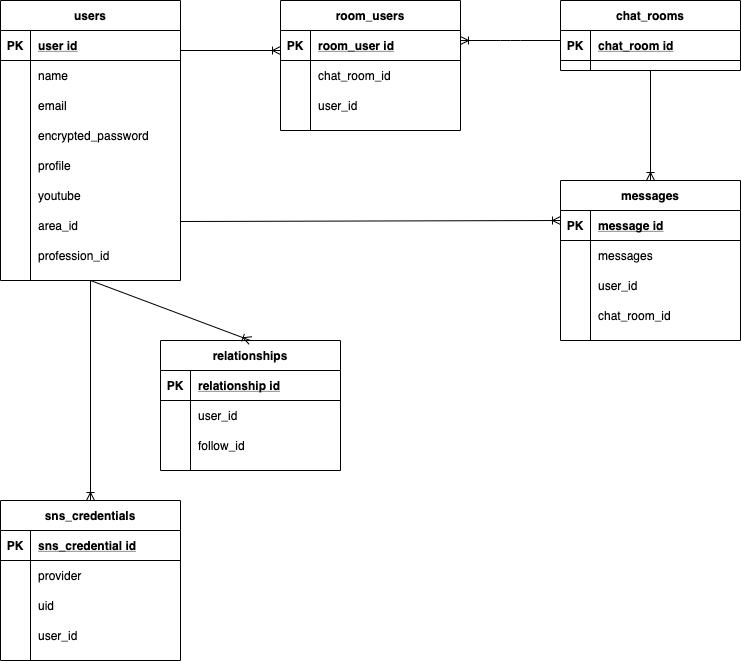

# アプリ名
### **Music Connect**

# 概要
ミュージシャン、バンドマンやライブハウスなど音楽に携わる人を支援するマッチングサービス。

# URL
http://www.music-connect.jp/

ログイン情報（テスト用） 
- Eメール: hoge@hoge.com
- password: aaa111

# 制作背景（意図）
　自分が「こういうアプリがあればいいのにな」というアプリを制作した。
 
　現状、音楽活動をしている人がライブに出演したい場合、ホームページから直接アプローチをかけるかTwitterとうのSNSでダイレクトメッセージを送り、またライブハウス等の事業者側も出演者を募るためTwitter等のSNSでアプローチを書けるのが主流である。
 
　なので、**ライブに出演したくないのにライブハウス側からオファーがきたり、出演者を募っていいないのにアーティストからメッセージが来るという問題点**がよく起こる
 
　そこで、Twitterの様な幅広いアプリではなく**音楽をする人向けに特化した需要と供給をマッチさせる**マッチングサービスを制作した。

# 機能一覧
- ユーザー登録・編集（gem devise, active hash）
- ログイン、ログアウト機能(gem devise)
- SNS認証 Google,Facebook(gem omniauth)

- プロフィール画像の登録（ActiveStorage）
- ユーザー一覧機能
- フォロー機能(非同期)
- マッチング機能
- メッセージ機能(ActionCable)
- ユーザー検索機能(gem ransack)

# 使用技術
## フロントエンド
- HTML
- CSS(SCSS)
- Bootstrap4
- Javascript

## バックエンド
- Ruby2.6.5
- Ruby on Rails 6.0.3.4

## データベース
- MySQL2 MariaDB

## テスト
- RSpec(SystemSpec)
- FactoryBot
- Faker

## 本番環境
- AWS(EC2, S3, Route53)
- Nginx
- Unicorn
- Capistrano

## ソース管理
- GitHub, GitHubDesktop
 

# DB設計

## usersテーブル

| Column             | Type      | Options     
| ----------         | ------    | ----------- 
| name               | string    | null: false
| email              | string    | null: false, unique: true
| encrypted_password | string    | null: false
| profile            | text      |
| youtube            | string    |
| area_id            | integer   | null: false
| profession_id      | integer   | null: false

### Association
- has_many :sns_credentials
- has_many :room_users
- has_many :chat_rooms, through: :room_users
- has_many :messages
- has_many :relationships,foreign_key: "user_id", dependent: :destroy
- has_many :followings, through: :relationships, source: :follow
- has_many :passive_relationships, class_name: "Relationship", foreign_key: "follow_id", dependent: :destroy
- has_many :followers, through: :passive_relationships, source: :user
- has_one_attached :image

## relationshipsテーブル
| Column           | Type      | Options     
| ----------       | ------    | ----------- 
| user             | reference | foreign_key: true
| follow           | reference | foreign_key: {to_table: :users}

### Association
- belongs_to :user
- belongs_to :follow, class_name: "User"

## chat_roomsテーブル
| Column        | Type      | Options     
| -------       | ------    | ----------- 

### Association
- has_many :room_users
- has_many :users, through: :room_users
- has_many :messages

## room_usersテーブル
| Column        | Type      | Options     
| -------       | ------    | ----------- 
| chat_room     | reference | foreign_key: true
| user          | reference | foreign_key: true

### Association
- belongs_to :user
- belongs_to :chat_room

## messagesテーブル
| Column        | Type      | Options     
| -------       | ------    | ----------- 
| message       | text      | null: false
| user          | reference | foreign_key: true
| chat_room     | reference | foreign_key: true

### Association
- belongs_to :user
- belongs_to :chat_room

## sns_credentialsテーブル
| Column        | Type      | Options     
| -------       | ------    | ----------- 
| provider      | string    |  
| uid           | string    |  
| user          | reference | foreign_key: true

### Association
- belongs_to :user

# ER図
